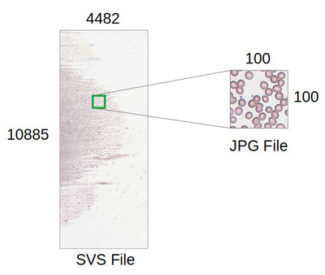

# svs-file-cropping

SVS files are usually very large image files. It is not easy to crop these files. If we convert it to complete image than it will take lot of time to read in python using opencv or PIL. This repository provide a solution to crop the patch of image from SVS file.



## Prerequisites

Following modules are needed:

| Modules              | Installation command                     |
| -------------------- | ---------------------------------------- |
| vips     | sudo apt install libvips-tools |
| numpy           | pip install numpy           |
| cv2 | pip install opencv-python |

## Procedure

1. First convert the svs file to dzi using vips library.

   Make sure you run the command with **overlap** equal to zero.

   ```bash
   vips dzsave x y --overlap=0
   ```

   where:

   | Variables | Description          | Example          |
   | --------- | -------------------- | ---------------- |
   | x         | Path to svs file     | path/to/test.svs |
   | y         | Output dzi directory | path/to/test     |

2. Run the **crop_svs.py** file.

   ```bash
   python3 crop_svs.py -i y -o z -c xmin, ymin, xmax, ymax
   ```

   where:

   | Variables | Description               | Example          |
   | --------- | ------------------------- | ---------------- |
   | z         | Path to image             | path/to/test.jpg |
   | xmin      | Top left x-coordinate     | 0                |
   | ymin      | Top left y-coordinate     | 0                |
   | xmax      | Bottom right x-coordinate | 100              |
   | ymax      | Bottom right y-coordinate | 200              |

## Release:

| Tag   | Date        | Description |
| ----- | ----------- | ----------- |
| 0.0.1 | 26-Aug-2021 | Test passed |

## Authors

* **Muhammad Tahir Rafique**
